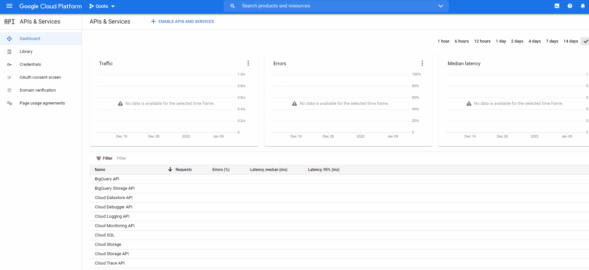
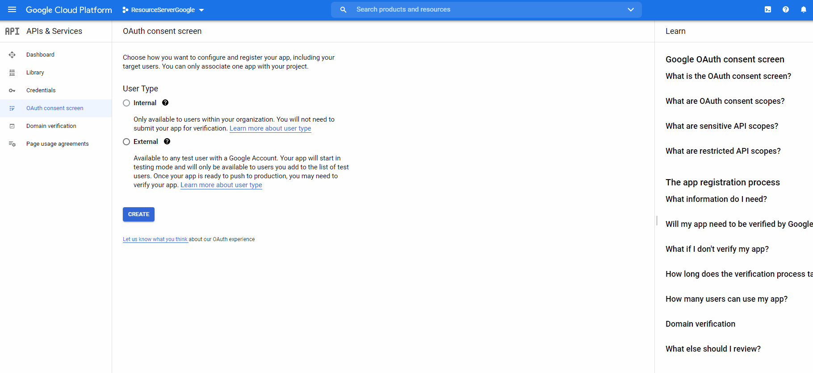
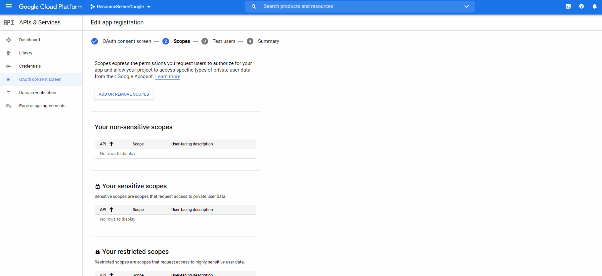
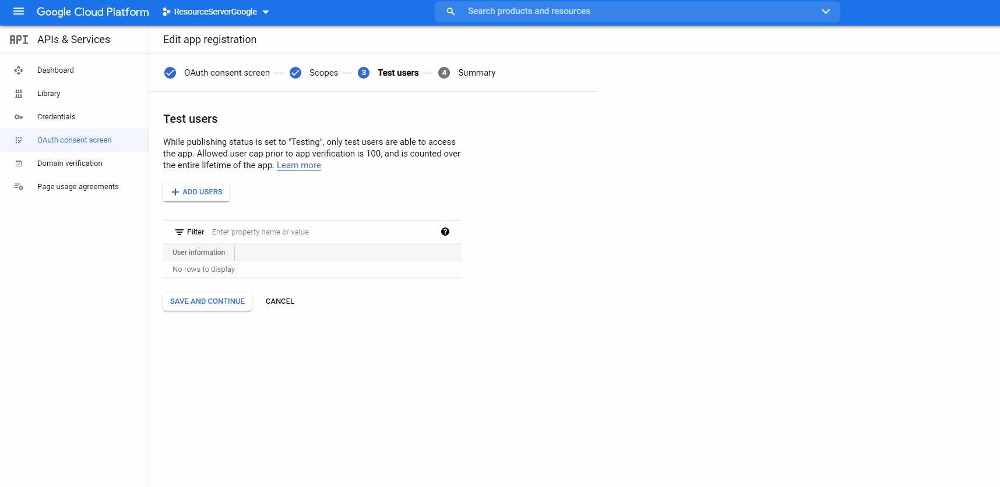
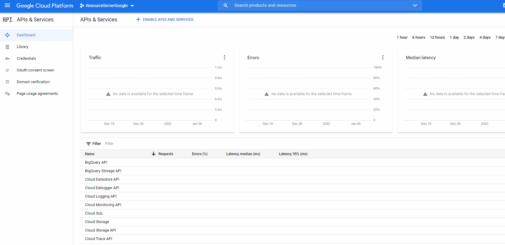

# learn-oath2-google
Sample project for learning securing REST API with Google as IDP.

## Configure Google OAuth2
> See [Guide](https://medium.com/geekculture/springboot-api-authentication-using-oauth2-with-google-655b8759f0ac)
### 1. Create New Project

In your [Google Cloud Console](https://console.cloud.google.com/?project=learning-oath2) create new project:



#### 2. Configure Consent Screen

Select the project from dropdown and go to `OAuth consent screen`.  
Make sure you select **External** and click **Create**



#### 3. Set Scopes

Select `openid`, `email` and `profile` as scopes:



#### 4. Set Test Users

Because the project will be in `Testing` mode we need to add some test users to work with. You can put
any gmail account as long as you know the password also.



#### 5. Create OAuth Client

Go to `Credentials` and click **CREATE CREDENTIALS**.

Make sure you select **OAuth client ID** and then **Web application** as type.



> Note: a pop-up will be displayed at the end containing your client id and secret. You need
> to copy these values and replace them in **application.yml** resource file.

#### 6. Postman As Callback

In order to generate a valid token using Postman we need to do an update to our OAuth Client
and specify a custom **Authorized redirect URI**. Open the OAuth Client and add https://www.getpostman.com/oauth2/callback
as value:


### Configure Postman

In order to be able to generate tokens using our Google OAuth Client we need to configure Postman for recognizing our
authorized redirect URI. Open Postman > New Request > Authorization > Select OAuth 2.0:


Make sure you put https://www.getpostman.com/oauth2/callback as **Callback URL** and your correct
client credentials.

Clicking **Get New Access Token** button should open a pop-up where you need to provide the credentials
for one of your test users. If the credentials are valid you should see something like:


> Note: copy the value of **id_token** because we need it later

*Result*
```json
{
  "web": {
    "client_id":"457099562219-n4qpce8uq8dinu0jtev8sv5egue5jgnh.apps.googleusercontent.com",
    "project_id":"learning-oath2",
    "auth_uri":"https://accounts.google.com/o/oauth2/auth",
    "token_uri":"https://oauth2.googleapis.com/token",
    "auth_provider_x509_cert_url":"https://www.googleapis.com/oauth2/v1/certs",
    "client_secret":"*sencored*",
    "redirect_uris": [
      "https://www.getpostman.com/oauth2/callback"
    ]
  }
}
```